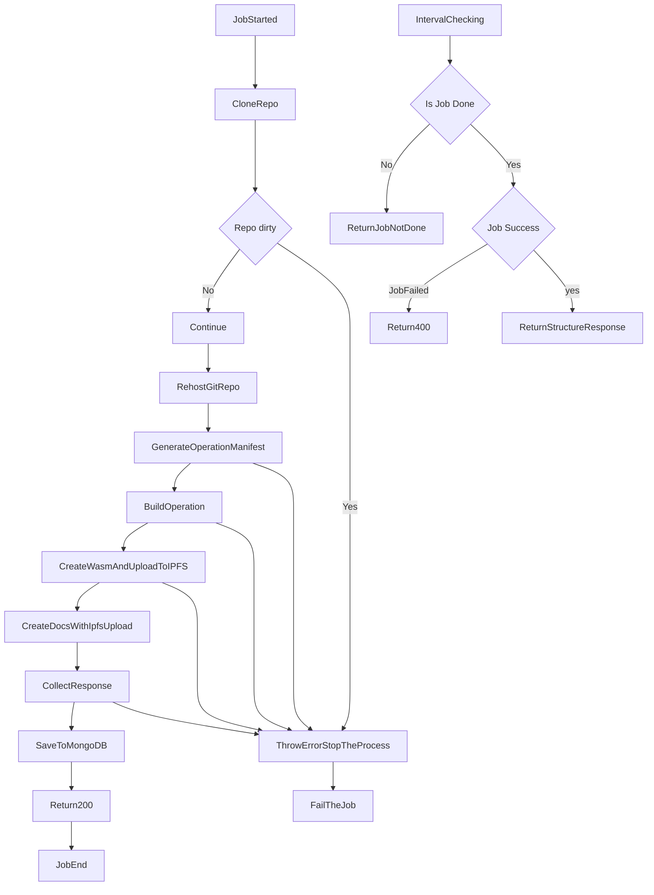
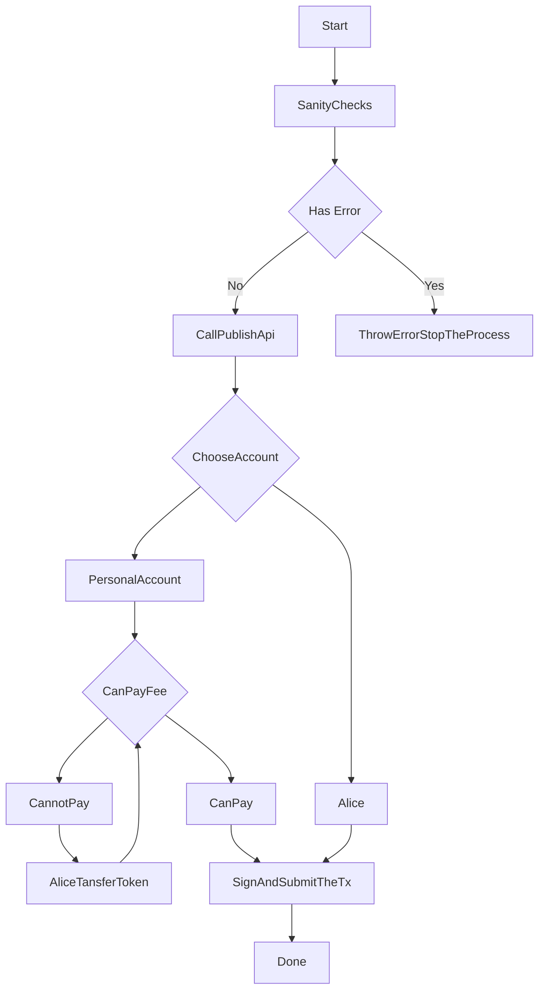

# Anagolay project Idiyanale phase 1 (Nr. 1) - Milestone 2

Hi and welcome to the support repo for the W3F grant [PR 719](https://github.com/w3f/Grants-Program/pull/719).

This is the continuation from the previous [Milestone 1](https://github.com/anagolay/w3f-grant-support-repo/tree/project-idiyanale-phase1_milestone-1). Certain documentation and descriptions will **not** be duplicated but referenced. 

---

The easiest way to start with this repo is to open it with the [VsCode Devcontainer](https://code.visualstudio.com/docs/remote/containers). It will set up the environment, all the dependencies and start all the docker containers which you will need for the successful demo.

Important files:

- [docker-compose.yml](./docker-compose.yml) is the main starting point as per agreed standard. There you can see all the services and their setup
- [devcontainer-dc.yml](./devcontainer-dc.yml) file is used for the devcontainer and it's not going to be used in the demo
- [.devcontainer/install-deps.sh](./.devcontainer/install-deps.sh) will clone 
  -  `op_file` repo
  -  `op_cid` repo
  -  `op_multihash` repo
  -  install the Anagolay CLI

Included in this environment:

- Docker services
  - [Publish Service](./docker-compose.yml#L3) -- More info [here](#what-is-a-publish-service)
  - [WS Service](./docker-compose.yml#L17) -- More info [here](#what-is-a-websocket-service)
  - [Anagolay Node](./docker-compose.yml#L24) -- More info [here](#anagolay-node-runtime)
  - [MongoDB](./docker-compose.yml#33) -- standard MongoDB instance
  - [IPFS node](./docker-compose.yml#45) -- standard IPFS instance
- Anagolay CLI -- Via rehosted IPFS version, this brings 100% code assurance
- LTS Nodejs 16
- [op_file](https://gitlab.com/anagolay/operations/op_file) repository cloned in the project root
- [op_cid](https://gitlab.com/anagolay/operations/op_cid) repository cloned in the project root
- [op_multihash](https://gitlab.com/anagolay/operations/op_multihash) repository cloned in the project root
- [env](./env) file with defaults that just works

**Debugging and cleanup if you need it**

If you wish to get rid of the bootstrap nodes.
```sh
# every time you recreate the containers run this if you want to remove the bootstrap nodes
docker-compose exec ipfs ipfs bootstrap rm all
docker-compose stop ipfs
docker-compose up -d ipfs
```

Debugging and cleanup

```sh
# stop and remove all containers and their volumes, very useful when debugging
docker-compose down --volumes

# start all the containers again
docker-compose up -d
```

Attaching to the logs

```sh
# get the logs from the publish service.
docker-compose logs --follow publish
```

🔗 Useful links:

- All the code for the Operation publish can be found [here](https://gitlab.com/anagolay/micro-services/-/blob/main/services/publish/src/jobs/publishOperation.ts#L52)
- The API documentation is located [here](https://documenter.getpostman.com/view/2220022/UVktpYgR)
- Repository is hosted here: https://gitlab.com/anagolay/micro-services
- OCI Publish Service: https://hub.docker.com/r/anagolay/microservices-publish
- OCI Websocket Service: https://hub.docker.com/r/anagolay/microservices-ws-service
- OCI Anagolay Node: https://hub.docker.com/r/anagolay/anagolay
- [Latest Anagolay Node docs](https://ipfs.anagolay.network/ipfs/bafybeieyp6szilglbepuvc7maz3crqfvdptpuslhgy6t5qbb3t3zuq2muy/anagolay/index.html)
- [Anagolay Custom Types](https://ipfs.anagolay.network/ipfs/bafkreif6m5qv2lrj5uh6qzomluwxxz2diupj3h55qkhmitbw6qflf2cdd4) for the usage with [PolkadotApp](https://polkadot.js.org/apps/?rpc=ws%3A%2F%2F127.0.0.1%3A9944#/explorer)
- [Anagolay Node repository](https://github.com/anagolay/anagolay-chain)

---

## What is a Publish Service?

> The explanation of this service is outlined in the [Milestone 1](https://github.com/anagolay/w3f-grant-support-repo/tree/project-idiyanale-phase1_milestone-1#what-is-a-publish-service), please go there to refresh your memory.


This is related to the [Anagolay CLI: Operation Part 1](https://github.com/anagolay/Grants-Program/blob/a6bd87adb3331db6efc8e7a96106c8efd53e4e31/applications/anagolay-project-idiyanale-phase-1.md#anagolay-cli-operation-part-1), initially thought to build and publish from the developers' machine, then we iterated over the idea and realized that approach would create potential vectors of the attack like the code injection ( for the generated JS files ), hijacking the Anagolay CLI extrinsic call, ipfs spamming, not having unified packages ( rust, node, cargo, ... ) for the reproducible builds. Due to these reasons ( and a few more ) we decided to create a publish service that unifies the environment and does all the building and publishing to the IPFS then returns the response in a structured way so the Anagolay CLI can use it. Additionally the service stores the built responses in the MongoDB for future queries and to prevent unnecessary builds. The unique id is the `revision`. Since the git object creation and revision is content based, this will always be unique.

This proved to be a good approach for multiple reasons, here are a few:

- developers machine is not used as a build machine
- developers do not have to run their IPFS and maintain the security
- unifying the environment with pinned package versions
- the build server is more powerful than dev machine
- better experience and saving local bandwidth
- digital nomad life-friendly

## How Publish Service works?

Now when we have explained what the Publish service is let's dive in and see what it does.

The simplified flowchart of the two main processes you can see [here](#publish-service-simplified-flow-diagram).

As you have seen in the diagram, the unification and standardization of the Operation build process is very important. If we want Operations to be as we envisaged them, then we need to make sure that the build succeeds every time, that the docs are not changed for the published version, and so on. That is why we are standardizing the Operation build process, starting with the [op-file](https://gitlab.com/anagolay/op-file) as described in the [grant](https://github.com/anagolay/Grants-Program/blob/a6bd87adb3331db6efc8e7a96106c8efd53e4e31/applications/anagolay-project-idiyanale-phase-1.md#operation---op_file) via the [cargo-make](https://github.com/sagiegurari/cargo-make) which is an excellent piece of tech, highly stable and configurable. The build configuration for the `op-file` ( and all other Operations in the future ) is located in the file called [Makefile.toml](https://gitlab.com/anagolay/op-file/-/blob/main/Makefile.toml) located on the same level as the `Cargo.toml`
. This file is used to check, format, develop and build the Operation and its WASM artifacts.

The generated documentation will yield the CID which is stored with the Version, since the docs are the rustdocs the default entrypoint can always be composed and since it's the hosetd on the IPFS any public gateway can be used.

The composition rule is following:

```ts
// pseudo code
const OPERATION_NAME = underscoreLowerCase(`Cargo.toml#name`); // op-file => op_file
const GATEWAY_URL = "ipfs.anagolay.network"; // or ipfs.io

// this is stored on the Anagolay chain as a part of the Version
const DOCS_CID = "bafybeiahkoghy4yozvqrp5q66mitk6kpxdec243mdzcel67jdt3gcyffi4";

const docUrl = `https://${GATEWAY_URL}/ipfs/${DOCS_CID}/${OPERATION_NAME}/index.html`;
// https://ipfs.anagolay.network/ipfs/bafybeiahkoghy4yozvqrp5q66mitk6kpxdec243mdzcel67jdt3gcyffi4/op_file/index.html
```

> ℹ️ If you didn't change the `env` file the api key is not needed even though the API documentation says that it is used.

# Deliverables

## Operation Pallet

As per grant [Milestone 1 deliverable](https://gitlab.com/anagolay/anagolay/-/tree/main/pallets/operations) we have implemented the pallet which you can see [here](https://gitlab.com/anagolay/anagolay/-/tree/main/pallets/operations) with all the functionality explained in the grant and some extra which we needed to add. This pallet is used directly by the Anagolay CLI for storing the Operation Manifest and the Version.

This part also includes the `Benchmarks: an_operation` deliverable.

## Anagolay CLI

As per grant Milestone 1 deliverable [Anagolay CLI: Operation Part 1](https://github.com/anagolay/Grants-Program/blob/a6bd87adb3331db6efc8e7a96106c8efd53e4e31/applications/anagolay-project-idiyanale-phase-1.md#anagolay-cli-operation-part-1) we have implemented the Anagolay CLI is a single Javascript file built to have a single external dependency, which is the LTS Nodejs 16 and all other dependencies are bundled together. The CLI itself is installed via the IPFS and has `0.7.0` version as static and never changing. The CLI will not be published on the npmjs registry nor any other registry that forces us to use Semver.
The CLI is accessible system-wide by tying `anagolay`. It will produce people-friendly help which should be used to learn more about its functionality and features.
For the purpose of this demo, the [env](./env) is used and annotated according to the usage, but in the future, we will not use such an approach unless we need overrides of the endpoints.
The CLI has the main purpose to be the entrypoint for the developer to publish the Operation ( and in the future develop, init, audit, etc ...).

For now, there is only one command that will produce any meaningful outcome and that is `anagolay operation publish`, which must be executed in the Operation directory. All the API calls are local and constrained within this environment.

The Anagolay CLI process flow diagrams is located [here](#anagolay-cli-simplified-flow-diagram).

### Publishing the Operation op-file via Anagolay CLI

> ℹ️ he CLI output looks a bit different than what is in the grant, we hope that is not going to cause any problems.

```sh
cd op-file
anagolay operation publish
? Do you want to proceed? (Y/n)
✔  success   Sanity checks, done!
  # the CLI will perform the sanity checks and make a call to the Publishing Service API
  # this is a good time to attach to the logs in a new terminal window : docker-compose logs --follow publish
  # DO NOT CANCEL THIS STAGE OR CLOSE THE TERMINAL
  ◟ Checking is the remote job done. This can take a while.

# if the build is successful you will see this
ℹ  info      Connected to Anagolay Node v0.3.0-acd0445-x86_64-linux-gnu
? How do you want to sign the TX (Use arrow keys)
❯ With Alice
  With my personal account # choosing this will require the mnemonic seed, account address and account type

#### one choice only
? How do you want to sign the TX With my personal account
? Account Eomg7nj6K8tJ116dZHLEL7tJdfMxD6Ue2Jc3b5qwCo5qZ4b
? Account type sr25519
? Mnemonic Seed [input is hidden]
  ◠ Not enough tokens, transferring 1 UNIT(s) # if the account doesn't have any tokens 1 UNIT will be transferred
✔  success   Token transfer done, blockHash is 0x7124813fbb952b6a70e96faaeda29bc8e643c149610a5f4eb96648078724da2a
> Operation TX is at blockHash 0x605982d8d2cbe7afa46702eb8b46f056ed7862cc8642a17dae61f6d667d28799
# this is the Operation ID which you can query via the PolkadotApp
> Operation ID is bafkr4ifsdakwrkew2aftprisolprbeipardj4mkoskder7vwtlqsuqhfqu
✔  success   Publishing is DONE 🎉🎉!
```

If you choose the `Alice` the flow is simpler, you are not asked anything and the extrinsic call is started.

Useful Links:

- [Anagolay Js Repository](https://gitlab.com/anagolay/anagolay-js/-/tree/main/sdk/cli)

## Operation - op_file

As per grant Milestone 1 [Operation - op_file](https://github.com/anagolay/Grants-Program/blob/a6bd87adb3331db6efc8e7a96106c8efd53e4e31/applications/anagolay-project-idiyanale-phase-1.md#operation---op_file) deliverable we have implemented the Operation as per our design and idea of how it should work, which is also shared in the grant document.

In the process of defining the Operations and the code structure, we wanted to provide an easy way of creating the Operation code, minimizing the dealing with the internals and boilerplate.

The outcome of this is the `Anagolay Operation Support`, a crate that factors common support functionality for Anagolay Workflow and Operation definition and execution.

It's composed of the following modules:

- `an-operation-support`: the library crate, intended to be the only package a new Operation must depend on it
- `an-operation-support-macros`: a procedural macro crate, needs to be separate from the rest of the library but it's re-exported by an-operation-support

In order to generate the manifest, `op-file` implements the Anagolay Operation Support `describe` macro [to annotate](https://gitlab.com/anagolay/op-file/-/blob/main/src/functions.rs#L33) the main `execute` function with correct inputs and flags.

While developing the `op-file` Operation we iterated on the Operation manifest and made a decision that we are including the `nostd` flag as a part of the Manifest definition while the WASM pacakge type are included as a part of the Operation Version and build always, regardless of the `nostd` flag.

This means that the `op-file` and other Operations will:

- compile to `nostd` or not -- `nostd= true | false` -- this is useful to know for the rust environment
- create binary -- `main.rs`
- create library -- `lib.rs`
- create wasm artifacts for following [Packge types](https://gitlab.com/anagolay/anagolay/-/blob/main/pallets/operations/src/types.rs#L104)
- create rustdocs -- this is automatically uploaded to IPFS in the publish service

To build the `op-file` for wasm targets you should run the `cargo make --profile production operation-flow`, but that is not advisable unless you will do all the publishing yourself and storing the transaction on the chain.

The source code structure is simple and minimal. Every Operation must have the same structure, and export the same methods, like `execute`, for both wasm and rust environments. The wasm-related functions are located in the `wasm.rs` file.

Useful Links:

- [op-file repository](https://gitlab.com/anagolay/op-file)
- [Anagolay Operation Support](https://gitlab.com/anagolay/an-operation-support)
- [Latest docs](https://ipfs.anagolay.network/ipfs/bafybeiahkoghy4yozvqrp5q66mitk6kpxdec243mdzcel67jdt3gcyffi4/op_file/index.html)

## Rust demo crate - Part 1

There is a directory called `rust-demo` where we demo the `op-file` functionality.

To run the demo do the following:

```sh
cd rust-demo
# to download default image
cargo run

# or you can pass any publicly available URL
cargo run -- <your_url>
```

---

## Diagrams

Better to have them at the end instead of in the middle of the text.

#### Publish service simplified flow diagram



---

#### Anagolay CLI simplified flow diagram


